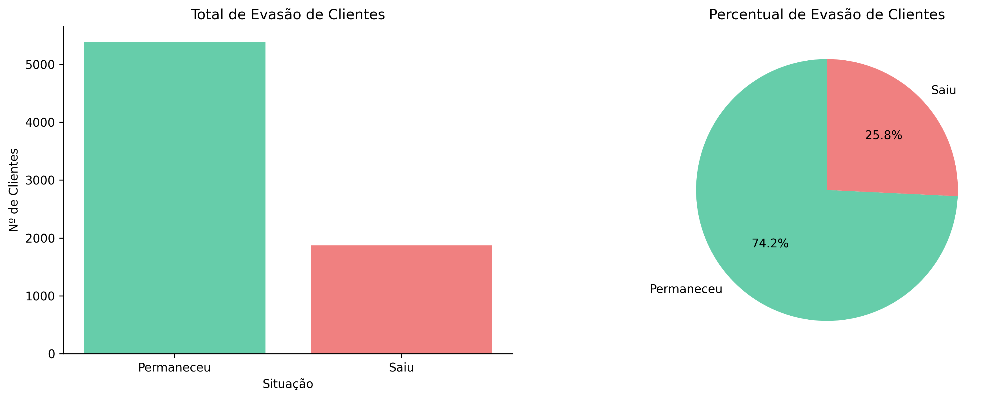
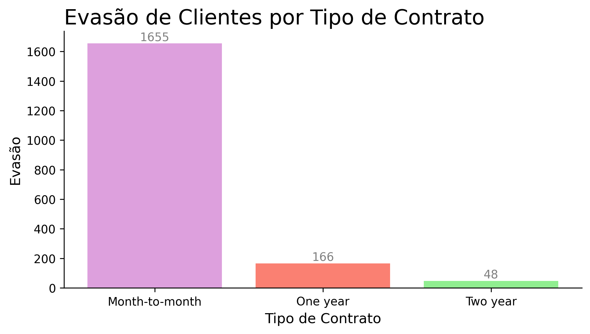
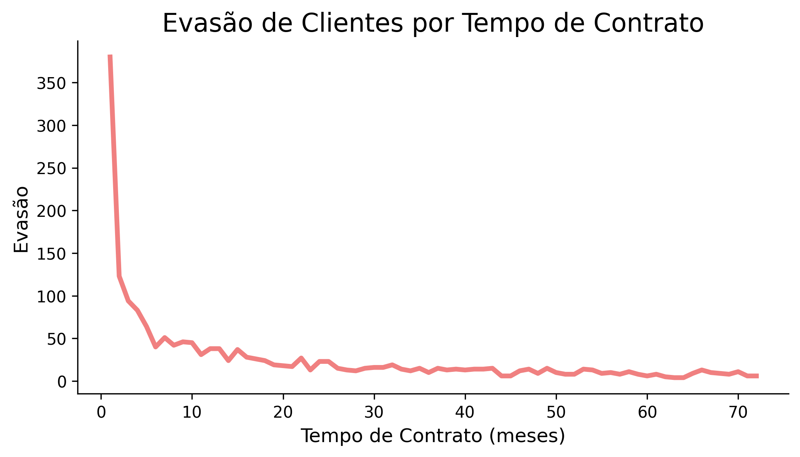

# ETL - TelecomX

## 👩🏻‍💻 Autoria
Elis Vieira Weiss

## 💡 Objetivos
Realizar as técnicas de Extração, Transformação e Carga dos dados de uma empresa de telecomunicação fictícia, a TelecomX. A fim de obter uma análise centrada na evasão dos clientes, através da junção de variáveis importantes, como Churn, account.Contract, tenure, etc. 
De modo a gerar gráficos que facilitem a visualização dessa análises, além obter insights quanto ao problema principal: a evasão.

## 💻 Ferramenta e Linguagem
Para esse projeto, foram utilizados o Google Colab como principal ferramenta e a Linguagem Python para códigos e geração de gráficos.

## 📚 Bibliotecas
* Pandas - para realizar as técnicas de ETL
* NumPy - para converter alguns tipos de dados numéricos
* Matplotlib - para a gerar os gráficos

## 📊 Exemplos de Gráficos e Insights Obtidos
* **Total de Clientes que Permaneceram e Saíram da Empresa**
 

 
Esse gráfico aponta que a TelecomX teve uma evasão total de 25.8%

* **Evasão por Tipo de Contrato**
 

 
Neste exemplo, notamos que os clientes que optaram pelo contrato mensal foram os que mais saíram da empresa.

* **Evasão por Tempo de Contrato**
 

 
Como exemplo final, temos esse gráfico de linha, que nos mostra que a grande parte dos clientes que cancelaram seu contrato com a TelecomX, saíram no primeiro mês de uso. O que nos sugere que a empresa deve se atentar em como seu serviço está impactando seus usuários nos primeiros meses de uso.

## 🧩 Como testar?
Abra o arquivo TelecomX.ipynb no Google Colab, em seguida, o execute da forma que preferir: linha a linha usando o botão de play em cada célula de código, ou tudo de vez, clicando no botão superior do Colab "Executar tudo".